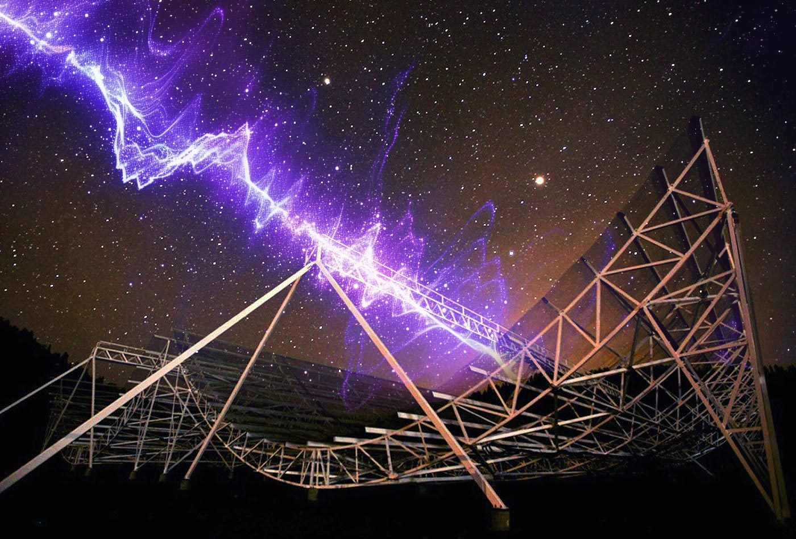

*CHIME 射电望远镜上空快速射电暴信号的艺术化示意图。图片来自 [SciTechDaily](https://scitechdaily.com/this-mysterious-radio-burst-came-from-nowhere-and-its-baffling-experts/)。署名：CHIME, edited。*

快速射电暴（FRB）是持续时间通常只有毫秒量级的明亮射电信号，大多来自银河系外。一些源目前只记录到一次爆发，另一些源则会重复爆发。极短的时标、极高的视亮度以及多样的宿主环境，使快速射电暴成为研究致密天体和高能等离子体过程的重要实验室。

快速射电暴在不同频率上的到达时间延迟，记录了传播路径上自由电子的总量。当宿主星系距离可测时，色散信息便能帮助我们探测难以直接看见的星系际物质。银河系磁陀星 SGR J1935+2154 产生的类FRB爆发证明，至少一部分快速射电暴可以由磁陀星产生，但其源族和辐射机制是否具有统一解释仍是开放问题。

## 我为什么关注它们

快速射电暴把射电时域天文学、中子星活动、高能暂现源及其周围环境联系起来。我尤其关注它们与特殊类型的脉冲星之间的联系，很好奇它们到底从何而来。

## 延伸阅读

- [NASA：快速射电暴的新线索](https://www.nasa.gov/missions/nustar/nasa-telescopes-find-new-clues-about-mysterious-deep-space-signals/)
- [维基百科：快速射电暴](https://zh.wikipedia.org/wiki/快速射电暴)
