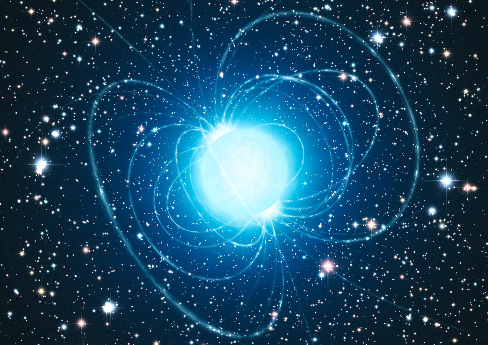

*Artist's impression of the magnetar in Westerlund 1. Credit: [ESO/L. Calçada](https://www.eso.org/public/images/eso1034a/), licensed under [CC BY 4.0](https://creativecommons.org/licenses/by/4.0/).*

Pulsars are highly magnetized, rapidly rotating neutron stars—the compact cores left behind by some stellar explosions. Their magnetic and rotation axes are usually misaligned, so beams of radiation sweep across space like a lighthouse. When a beam crosses Earth, a telescope records a pulse. These signals were first found at radio wavelengths, but pulsars can also be observed in optical light, X-rays, and gamma rays.

Because their rotation can be extraordinarily stable, pulsars are natural precision clocks. Their pulse arrival times reveal spin evolution, binary motion, propagation through ionized plasma, and changes in the magnetosphere. At the same time, young and strongly magnetized pulsars connect compact-object physics to supernova remnants and other energetic environments.

## Why they interest me

I use radio and multi-wavelength observations to study how neutron-star magnetic fields, surrounding media, and emission geometry shape the radiation we observe. Pulsars provide a direct route from measured pulse profiles and timing behavior to the physics of extreme matter and magnetic fields.

## Further reading

- [NASA: Pulsars](https://science.nasa.gov/mission/hubble/science/science-behind-the-discoveries/hubble-pulsars/)
- [Wikipedia: Pulsar](https://en.wikipedia.org/wiki/Pulsar)
