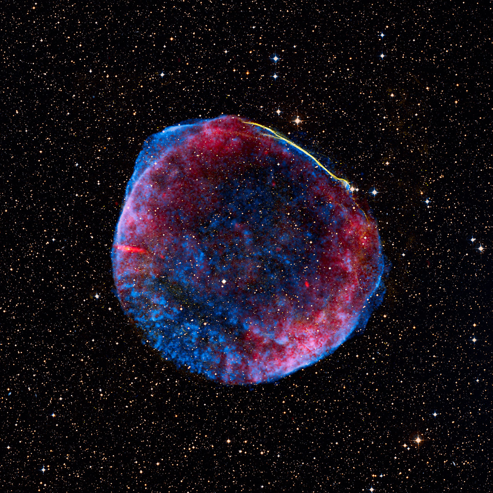

*The SN 1006 supernova remnant in radio (red), X-ray (blue), and visible light (yellow). [Source: ESO](https://www.eso.org/public/images/eso1308b/). Credit: Radio: NRAO/AUI/NSF/GBT/VLA/Dyer, Maddalena & Cornwell, X-ray: Chandra X-ray Observatory; NASA/CXC/Rutgers/G. Cassam-Chenaï, J. Hughes et al., Visible light: 0.9-metre Curtis Schmidt optical telescope; NOAO/AURA/NSF/CTIO/Middlebury College/F. Winkler and Digitized Sky Survey.*

A supernova remnant (SNR) is the expanding debris left after a stellar explosion. Fast ejecta drive a forward shock into the surrounding interstellar medium, while a reverse shock propagates back into the ejecta. These shocks heat gas to X-ray-emitting temperatures and can accelerate particles that radiate from radio wavelengths to gamma rays.

Remnants preserve information about both the explosion and the environment shaped by the star before it died. Their spectra and morphology reveal freshly synthesized elements, magnetic fields, dense clouds, and compact remnants such as neutron stars. Following an SNR across multiple wavelengths is therefore a way to reconstruct the coupled evolution of the explosion, ejecta, and surrounding medium.

## Why they interest me

Supernova remnants provide the physical context in which many young neutron stars evolve. By comparing multiwavelength information, I study how weak or energetic explosions interact with their environments and how those interactions affect what we observe from the compact object.

## Further reading

- [NASA: Supernova remnants](https://science.nasa.gov/mission/hubble/science/universe-uncovered/hubble-nebulae/#supernova-remnants)
- [Wikipedia: Supernova remnant](https://en.wikipedia.org/wiki/Supernova_remnant)
